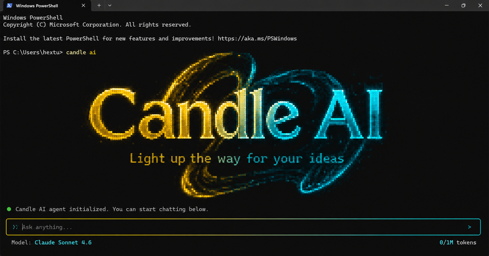

# Candle AI

**Light up the way for your ideas.**

Candle AI is a terminal-based personal AI assistant that runs multi-agent workloads locally. It features a lavish chat box UI, build/plan modes, 48 slash skills, session storage on disk, desktop access, custom agents, multi-provider model switching, and optional ElevenLabs MCP voice.



---

## Features

- **Terminal TUI** matching the Candle AI gold→cyan aesthetic
- **Commands**
  - `candle` — start the app
  - `candle setup` — username, password, API provider + key, search provider
  - `candle create agent` — scaffold a custom agent
  - `candle skills list` — list all 48 skills/commands
- **Build mode** & **Plan mode** (lavish buttons, Tab to focus, Enter to select)
- **48 skills** — type `/` in the chat box for a scrollable picker
- **`/model`** — pick models from your provider + others; add custom models + keys
- **`/agent`** — switch between build, plan, and custom agents
- **Local sessions** in `sessions/` (delete a file = permanently gone)
- **Desktop access** for agent file work
- **ElevenLabs MCP** — connect your ElevenLabs API key for TTS / voice agents
- **Stack**: TypeScript (TUI/CLI), Python (engine/tools), Swift (macOS companion)

---

## Requirements

- **Node.js** 18+
- **Python** 3.10+
- (Optional, macOS) **Swift 5.9+** for the native companion
- An API key from one of: OpenRouter, OpenAI, Anthropic, Grok (xAI), Google Gemini, Novita, Kimi, Kilo, OpenCode Zen, or custom

---

## Installation

### 1. Clone

```bash
git clone https://github.com/Mcalrifle789/Candle-AI.git
cd Candle-AI
```

### 2. Install Node dependencies

```bash
npm install
npm run build
npm link
```

`npm link` exposes the global `candle` command.

Without link, run:

```bash
npx tsx src/cli/index.ts
# or
node bin/candle.js
```

### 3. Python engine (optional but recommended)

```bash
pip install -r python/requirements.txt
# Engine uses the stdlib by default — no hard deps required.
```

### 4. Setup

```bash
candle setup
```

You will be asked for:

1. **Username** & **password** (stored as a salted hash locally)
2. **API provider** (OpenRouter, OpenAI, Anthropic, Grok, Gemini, …)
3. **API key**
4. **Search provider** (DuckDuckGo, Gemini, Parallel, Parallel Free, Tavily, Brave, Bing, Serper)
5. Optional **ElevenLabs** API key (MCP voice)
6. **Desktop access** permission

### 5. Launch

```bash
candle
```

---

## In-app usage

| Input | Action |
|--------|--------|
| Type a message | Chat with the active agent |
| `/` | Open scrollable skills list (48 commands) |
| `/model` | Open model picker |
| `/model add name\|provider\|id\|apikey` | Register a custom model |
| `/agent` | Switch agents (build / plan / custom) |
| `/mode` or **Tab** | Toggle BUILD / PLAN |
| `/search <q>` | Web search |
| `/desktop` | List Desktop files |
| `/image <prompt>` | Create image artifact |
| `/voice <text>` | ElevenLabs TTS |
| `/elevenlabs <key>` | Save ElevenLabs key |
| `/new` | New session |
| `/sessions` | Show sessions path |
| **Esc** | Quit |

Animated candle 🕯️ appears beside the chat box while buffering.

---

## Project layout

```
Candle AI/
├── bin/candle.js          # CLI entry
├── src/
│   ├── cli/               # commander entry
│   ├── ui/                # Ink TUI (logo, chatbox, pickers)
│   ├── core/              # config, sessions, agents, models
│   ├── skills/            # 48 skills registry
│   ├── providers/         # LLM + tool routing
│   └── commands/          # setup, create agent, skills list
├── python/candle_engine/  # search, desktop, image, ElevenLabs MCP
├── swift/CandleAI/        # macOS companion
├── sessions/              # local chat history (gitignored contents)
├── agents/                # builtin + custom agents
├── config/                # user.json + secrets.json (local)
└── assets/                # logo + reference UI
```

---

## Sessions privacy

All chats are written under `sessions/` as JSON files inside the app folder.

- Delete a session file → that conversation is **gone forever**
- Nothing is uploaded unless you call a configured provider API

---

## Custom agents

```bash
candle create agent
```

Creates:

```
agents/custom/<id>/
  agent.json
  prompt.txt
  README.md
```

Switch with `/agent` inside the TUI.

---

## ElevenLabs MCP

1. During `candle setup`, enable ElevenLabs and paste your key  
   **or** run `/elevenlabs <api-key>` in chat
2. Use `/voice Hello from Candle AI`
3. Audio is saved under `sessions/audio/`

---

## Swift companion (macOS)

```bash
cd swift/CandleAI
swift run candle-swift
```

Lists Desktop contents via native APIs for bridging with the agent.

---

## Development

```bash
npm run dev          # tsx hot entry
npm run build        # compile to dist/
python python/candle_engine/main.py search --provider duckduckgo --query "Candle AI"
```

---

## Security notes

- Secrets live in `config/secrets.json` (gitignored)
- Passwords are scrypt-hashed; the plaintext is never stored
- Rotate any API keys that were shared in chat or screenshots

---

## License

MIT © Mcalrifle789

---

**Candle AI** — *Light up the way for your ideas.*
